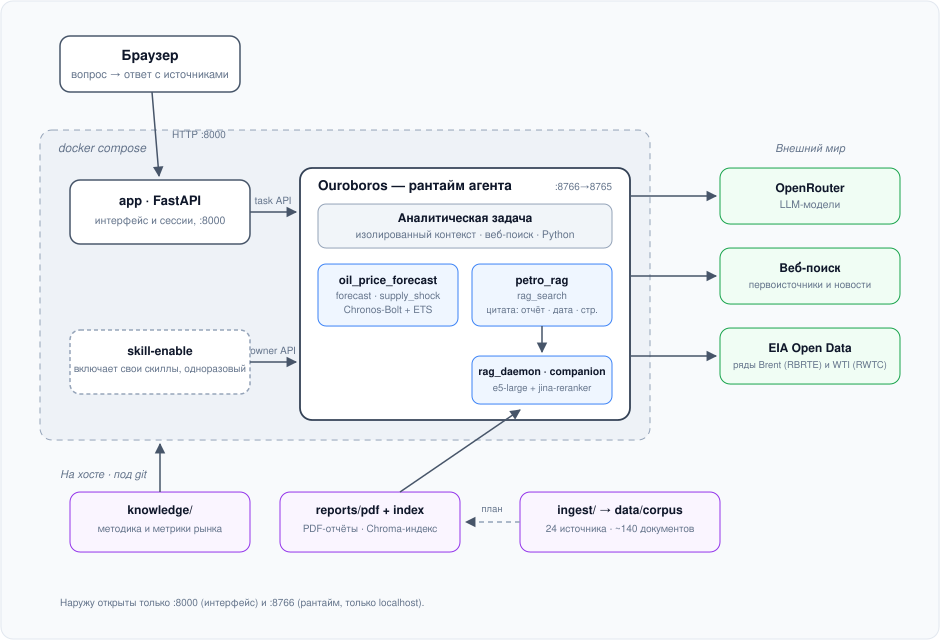
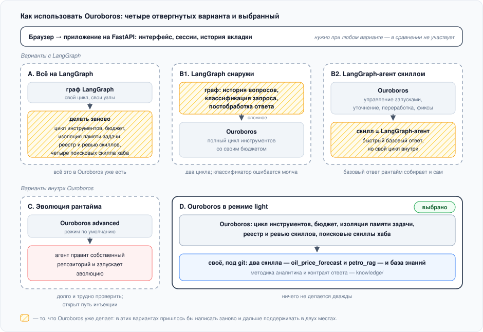

<div align="center">

# 🛢️ Нефтегазовый аналитик

**Агент-аналитик нефтегазового рынка: веб-поиск, собственный RAG по отраслевым отчётам и
расчётное прогнозирование цен. Каждое число в ответе — с датой среза и проверяемой ссылкой.**


</div>

## Запуск

```bash
git clone --recurse-submodules https://github.com/dertty/petro-market-analyst.git
cd petro-market-analyst
cp .env.example .env      # вписать OPENROUTER_API_KEY
docker compose up --build
```

Интерфейс — <http://127.0.0.1:8000>. Обязателен только `OPENROUTER_API_KEY`; остальное в
`.env.example` уже преднастроено (модели, бюджет, режим рантайма). Первая сборка занимает
несколько минут (в образ ставится расчётный стек и веса моделей). Ключи, настройки и
обновление — в [docs/OPERATIONS.md](docs/OPERATIONS.md).

## Архитектура и цифры

<table width="100%">
<tr>
<td width="62%" valign="top">



</td>
<td width="38%" valign="top">

<p><b>89%</b> — Recall@8 поиска по отчётам: нужные фрагменты
в первых восьми результатах
(<a href="skills/petro_rag/tests/README.md">замеры</a>)</p>
<p><b>78%</b> — соответствие протоколу: детерминированные
проверки контракта ответа
(<a href="docs/EVAL-AGENT.md">методика</a>)</p>
<p><b>92%</b> — экспертная оценка по рубрике (human eval)</p>
<p><b>317 с</b> и <b>$0,15</b> — латентность и стоимость
одного ответа при длине траектории 13 раундов</p>
<p>Подробные метрики и точки роста каждого модуля — в разделе
«<a href="#собственные-скиллы">Собственные скиллы</a>».</p>

</td>
</tr>
</table>

## Примеры работы

Примеры реальных ответов агента — из прогона по golden-датасету
(34 вопроса, `reports/golden_agent_dataset.jsonl`; методика —
[docs/EVAL-AGENT.md](docs/EVAL-AGENT.md)), по одному на сценарий.

<details>
<summary><b>«Как SberCIB прогнозирует изменение дисконта Юралз в 2027 году по сравнению с 2026-м?»</b> — ответ по отчёту: цитата со страницей</summary>

Согласно базовому прогнозу SberCIB из «Стратегического спутника» (декабрь 2025), дисконт Юралз FOB меняется следующим образом:

- **2026:** $15,0/барр. (Brent $60,0 − Urals $45,0)
- **2027:** $10,0/барр. (Brent $65,0 − Urals $55,0)

Источник — прямая таблица из отчёта [SberCIB: Стратегический спутник — прогнозы на 2026, 2025-12-02, с. 29].

**Изменение: дисконт сокращается на $5/барр. — с $15 до $10,** то есть примерно на треть.

##### Логика прогноза

SberCIB закладывает постепенную нормализацию дисконта по мере ослабления эффекта от санкций конца 2025 года против «Роснефти» и «Лукойла» (расширивших дисконт с \~$12–13 до $20+ в ноябре 2025). Траектория:

- **2К26:** дисконт возвращается к \~$15/барр. [SberCIB: Нефтяной рынок в 2026 году — аналитический обзор и прогноз, 2026-02-25, с. 13].
- **Конец 2026:** снижение до $10–12/барр. [SberCIB: Стратегический спутник — прогнозы на 2026, 2025-12-02, с. 49].
- **2027 (среднее за год):** $10/барр. [SberCIB: Стратегический спутник — прогнозы на 2026, 2025-12-02, с. 29].

Росту Urals и сужению дисконта, по оценке SberCIB, способствуют снижение ключевой ставки ЦБ, ослабление рубля (USD/RUB: 100 → 102 на конец периода) и ожидаемое восстановление EPS экспортёров [SberCIB: Стратегический спутник — прогнозы на 2026, 2025-12-02, с. 53].

##### Оговорка

Прогноз декабрьский (2025-12-02). Более поздний экспресс-обзор SberCIB от марта 2026 года — после конфликта на Ближнем Востоке — повысил оценку Urals на 2026 год до $50/барр. [SberCIB: Рынок нефти — влияние конфликта на Ближнем Востоке и блокады Ормузского пролива, 2026-03-18, с. 1], что при Brent $60 дало бы дисконт \~$10 уже в 2026-м. Однако этот мартовский обзор не содержит обновлённого прогноза на 2027 год, поэтому прямое сравнение 2026→2027 возможно только по декабрьскому базовому сценарию: **сокращение дисконта с $15 до $10/барр.**

Сам SberCIB отмечает риск того, что дисконт может сокращаться медленнее при ужесточении санкций [SberCIB: Нефтяной рынок в 2026 году — аналитический обзор и прогноз, 2026-02-25, с. 13].

---

#### Источники

1. [SberCIB: Стратегический спутник — прогнозы на 2026, 2025-12-02, с. 29] — таблица «Прогноз средних цен на нефть»: Brent, Urals FOB и дисконт на 2023–2027.
2. [SberCIB: Стратегический спутник — прогнозы на 2026, 2025-12-02, с. 7] — сводная таблица базового сценария: Brent и Urals на 2026–2028.
3. [SberCIB: Стратегический спутник — прогнозы на 2026, 2025-12-02, с. 49] — снижение дисконта Юралз до $10–12/барр. к концу 2026 г.
4. [SberCIB: Стратегический спутник — прогнозы на 2026, 2025-12-02, с. 53] — снижение дисконта и ослабление рубля как драйверы роста EPS.
5. [SberCIB: Нефтяной рынок в 2026 году — аналитический обзор и прогноз, 2026-02-25, с. 13] — Brent $60/барр., Urals $45/барр., дисконт $15/барр. во 2К26, риски более длительного увеличения дисконта.
6. [SberCIB: Рынок нефти — влияние конфликта на Ближнем Востоке и блокады Ормузского пролива, 2026-03-18, с. 1] — повышение оценки Urals 2026 до $50/барр. (без обновления 2027).

</details>

<details>
<summary><b>«Как изменились коммерческие запасы нефти в США по последнему недельному отчёту EIA?»</b> — ответ по вебу: свежие данные с датой среза и первоисточником</summary>

#### Коммерческие запасы нефти в США: отчёт EIA от 5 августа 2026

**Последний отчёт** — Weekly Petroleum Status Report, выпущен **5 августа 2026**, данные за неделю, закончившуюся **31 июля 2026**.

**Коммерческие запасы сырой нефти (без SPR) выросли на 2,48 млн баррелей** (точнее: +2,479 млн), до **406,99 млн баррелей** — против ожиданий рынка снижения на 1,5 млн баррелей [EIA WPSR, 2026-08-05, web]; [IndexBox: EIA Weekly Petroleum Report August 5, 2026, 2026-08-05, web].

Неделей ранее запасы составляли 404,51 млн баррелей. Рост оказался неожиданным для рынка — консенсус ожидал draw [Mace News / TradingView, 2026-08-05, web].

##### Контекст

- **Относительно пятилетнего среднего:** запасы примерно на **6% ниже** сезонной нормы [IndexBox, web].
- **Cushing (НПЗ-хаб в Оклахоме):** +2,36 млн барр., до 20,96 млн барр. [The Oil Report / Substack, 2026-08-05, web].
- **Стратегический резерв (SPR):** –2,84 млн барр., до 304,81 млн барр. [NewsBreak / Anas Alhajji, 2026-08-05, web].
- **Суммарные запасы (коммерческие + SPR):** 711,8 млн барр. — минимум с марта 1984 г. [The Peninsula Qatar, 2026-08-05, web].
- **Бензин:** –1,64 млн барр., до 209,66 млн барр. (–7% к пятилетней норме).
- **Дистилляты:** –3,47 млн барр., до 107,16 млн барр. (–12% к норме).
- **Пропан/пропилен:** +0,8 млн барр. (+32% к норме).
- **Загрузка НПЗ:** 96,5% (–183 тыс. барр./сут. к пред. неделе), переработка — 17,2 млн барр./сут.
- **Импорт сырой нефти:** 6,2 млн барр./сут. (+515 тыс. к пред. неделе).
- **WTI на 31 июля:** $86,16/барр. (–$5,58 за неделю).

##### Суть

Рост коммерческих запасов при одновременном снижении запасов нефтепродуктов (бензин, дистилляты) и продолжении выпуска из SPR — картина, характерная для периода высокого импорта при сезонно-пиковой, но уже начавшей снижаться загрузке НПЗ. Рынок ждал сокращения запасов и получил рост — отсюда и медвежья реакция на цифры.

---

#### Источники

1. **EIA — Weekly Petroleum Status Report**, 2026-08-05, данные за неделю до 2026-07-31 — [eia.gov/petroleum/supply/weekly/, web](https://www.eia.gov/petroleum/supply/weekly/) (официальный первоисточник).
2. **IndexBox — «EIA Weekly Petroleum Report August 5, 2026: Refinery Inputs Down, Imports Up, Prices Mixed»**, 2026-08-05 — [indexbox.io, web](https://www.indexbox.io/blog/weekly-petroleum-status-report-crude-inventories-rise-gasoline-and-distillate-stocks-fall/).
3. **Mace News / TradingView — «US EIA Crude Oil Inventories +2.5 Mln Barrels»**, 2026-08-05 — [tradingview.com, web](https://www.tradingview.com/news/macenews:fb301fb8b094b:0-us-eia-crude-oil-inventories-2-5-mln-barrels-in-latest-week-from-previous-week-vs-1-5-mln-markets-expected/).
4. **The Peninsula Qatar — «US crude oil inventories increase last week»**, 2026-08-05 — [thepeninsulaqatar.com, web](http://thepeninsulaqatar.com/article/05/08/2026/us-crude-oil-inventories-increase-last-week).
5. **Anas Alhajji / Substack — «US Oil Shockwave: Inventories Plunge, Four Seas Crisis Explodes»**, 2026-08-05 — [anasalhajjieoa.substack.com, web](https://anasalhajjieoa.substack.com/p/us-oil-shockwave-inventories-plunge).
6. **The Oil Report / Substack — «EIA Inventories»**, 2026-08-05 — [theoilreport.substack.com, web](https://theoilreport.substack.com/p/eia-inventories-54b).
7. **MRT.com — «Energy shortage concerns ease after U.S. crude build»**, 2026-08-06 — [mrt.com, web](https://mrt.com/business/oil/article/us-crude-oil-inventories-eia-22377829.php).

</details>

<details>
<summary><b>«Реализовался ли рисковый сценарий SberCIB по Ормузскому проливу — что там происходит сейчас?»</b> — комбинированный: отчёт против свежего веба, сценарий и факт</summary>

#### Рисковый сценарий SberCIB: что предполагалось

В отчёте от **18 марта 2026 года** SberCIB описал рисковый сценарий: ограничения на проход через Ормузский пролив сохраняются **два-три месяца**, что вызывает глобальный шок предложения. Среднегодовая цена Brent в этом сценарии — **$81/барр.** (+$14/барр. к базовому), Urals — **$64/барр.**, нормализация — лишь во втором полугодии [SberCIB: Рынок нефти — влияние конфликта на Ближнем Востоке и блокады Ормузского пролива, 2026-03-18, с. 2].

#### Что происходит сейчас (10 августа 2026)

**Рисковый сценарий SberCIB не просто реализовался — он был превышен по длительности.**

- Конфликт и нарушение судоходства начались **28 февраля 2026** — прошло уже более пяти месяцев, а не 2–3. Пролив формально не перекрыт полностью, но **трафик танкеров сократился примерно на 70%** от нормального уровня [Kpler: Strait of Hormuz crossings drop 70%, 2026-07-23, web].
- **Сотни судов с \~6 000 моряков** остаются заблокированными в Персидском заливе; IMO в начале июля осудила новые атаки на коммерческие суда в проливе [IMO, web].
- Иран и Оман ведут переговоры о временном коридоре судоходства. Глава МИД Ирана **9 августа** заявил, что переговоры находятся в финальной стадии, но подчеркнул: это не означает открытия пролива. Обсуждается соглашение на **60 дней** с назначенными полосами движения. Полное открытие увязано Ираном с более широкими условиями безопасности, включая уступки США [AP News: Iran and Oman make progress, 2026-08-09, web; Axios: U.S. nears Hormuz deal, 2026-08-05, web].
- **Цена Brent сегодня**, 10 августа 2026: **\~$84,4/барр.** [Investing.com, web] — близка к среднегодовому прогнозу SberCIB для рискового сценария ($81/барр.), но ниже пиковых значений II квартала (\~$103/барр. по оценке EIA). EIA ожидает снижения Brent до **\~$70/барр. к IV кварталу** при постепенном восстановлении потоков [EIA STEO, июль 2026, web].

#### Оценка реализации

| Параметр | Рисковый сценарий SberCIB | Факт на 10.08.2026 |
|---|---|---|
| Длительность нарушения | 2–3 месяца | >5 месяцев (с 28.02.2026) |
| Характер нарушения | Блокада | Частичное нарушение (\~70% трафика) |
| Brent, среднегодовая | $81/барр. | Пока выше ($103 во II кв., $84 сейчас) |
| Нормализация | Со II полугодия | Не началась; переговоры в финальной стадии |

**Вывод:** сценарий SberCIB по состоянию на 10 августа **реализовался с превышением по длительности**, хотя форма блокады оказалась не полной, а частичной (\~70% потери трафика). Ценовая динамика: пик пришёлся на II квартал (\~$103/барр.), затем коррекция до текущих \~$84/барр. Ключевой риск сохраняется: даже при достижении временного соглашения возврат к нормальному судоходству займёт недели — страховщикам и операторам потребуются подтверждённые гарантии безопасности.

---

#### Источники

1. **SberCIB: Рынок нефти — влияние конфликта на Ближнем Востоке и блокады Ормузского пролива**, 2026-03-18, с. 1–3 — загруженный отчёт (RAG)
2. **SberCIB: Нефтяной рынок в 2026 году — аналитический обзор и прогноз**, 2026-02-25, с. 11 — загруженный отчёт (RAG)
3. **Kpler: Strait of Hormuz crossings drop 70% as tanker traffic shifts almost entirely to the Iranian route**, 2026-07-23 — веб-источник
4. **IMO: Secretary-General condemns new attacks on ships in the Strait of Hormuz**, начало июля 2026 — веб-источник
5. **AP News: Iran and Oman make progress on a deal to reopen the Strait of Hormuz**, 2026-08-09 — веб-источник
6. **Axios: U.S. nears Hormuz deal, aiming for Wednesday announcement**, 2026-08-05 — веб-источник
7. **EIA: Short-Term Energy Outlook, Global Oil Markets**, июль 2026 — веб-источник
8. **Investing.com: Brent Oil Futures Historical Prices**, данные на 2026-08-10 — веб-источник

</details>

<details>
<summary><b>«Что будет с ценой нефти, если ОПЕК+ сократит добычу на 1 млн баррелей в сутки?»</b> — расчётный модуль: сценарий добычи через эластичности</summary>

#### Что будет с ценой нефти при сокращении добычи ОПЕК+ на 1 млн барр./сут.

##### Расчёт через модель supply shock (сравнительная статика)

Расчётный модуль даёт следующие оценки — не временной прогноз, а сравнительную статику: куда сместится равновесная цена при заданном шоке предложения.

**Исходные данные:**
- Якорная цена Brent (спот FOB Европа): **$88,9/барр.** на 3 августа 2026 (7 дней назад) [EIA, серия RBRTE]
- Мировое предложение: **103,0 млн барр./сут.**
- Сокращение на 1 млн б/с = **−0,97%** мирового предложения

**Результаты:**

| Сценарий | Эластичность спроса | Эластичность предложения | Δ цены | Расчётная цена |
|----------|--------------------|--------------------------|--------|---------------|
| Гибкий рынок (высокие эластичности) | 0,10 | 0,12 | +4,4% | **$92,8** |
| **Центральный сценарий** | **0,06** | **0,07** | **+7,5%** | **$95,5** |
| Жёсткий рынок (низкие эластичности) | 0,02 | 0,02 | +24,3% | **$110,5** |

**Итог:** центральная оценка — Brent около **$95,5/барр. (+$6,6 к текущему якорю)**, диапазон **$92,8–110,5** в зависимости от жёсткости рыночных условий.

Эластичности взяты из академической литературы: Hamilton (2009); Baumeister & Peersman (2013); Caldara, Cavallo & Iacoviello (2019).

##### Контекст: что говорят отчёты и макрофон

**Текущий рынок заметно жёстче, чем предполагали прогнозы начала года.** SberCIB в феврале 2026 давал базовый прогноз Brent на 2026 год — **$60/барр.** [SberCIB: Нефтяной рынок в 2026 году — аналитический обзор и прогноз, 2026-02-25, с. 2], исходя из ожидаемого профицита в 2–4 млн б/с. Декабрьский «Стратегический спутник» SberCIB давал ту же цифру: Brent — **$60** в среднем за 2026 [SberCIB: Стратегический спутник — прогнозы на 2026, 2025-12-02, с. 29]. Фактический спот Brent на 3 августа — **$88,9** — на **$28,9 выше** этих прогнозов.

**Почему рынок ушёл выше прогнозов?** Макрофон даёт подсказку. Индекс глобальной реальной активности Килиана (IGREA, прокси мирового спроса на нефть) составил **54,26 пункта** на май 2026 — рост на **+21,85 пункта за месяц** и на **+79,98 пункта за год** [FRED, серия IGREA]. Это сигнал мощного восстановления спроса, который не был заложен в прогнозы начала года. Дополнительно индекс доллара снизился до **119,7** (−1,2% за месяц, −1,7% за год) [FRED, DTWEXBGS], что поддерживает долларовые цены сырья.

Сам SberCIB в февральском отчёте предусматривал **оптимистичный сценарий** («возврат к балансу»): при ужесточении политики ОПЕК+ и сокращении добычи — Brent выше **$70–75** [SberCIB: Нефтяной рынок в 2026 году — аналитический обзор и прогноз, 2026-02-25, с. 10]. Волатильный/геополитический сценарий того же отчёта допускал **> $90** [там же, с. 11]. Текущая цена **$88,9** уже находится вблизи верхней границы этих альтернативных сценариев — то есть рынок по факту реализовал оптимистичную траекторию, при которой дополнительное сокращение добычи ОПЕК+ на 1 млн б/с действует с более высокой базы.

##### Сопоставление с базовым прогнозом временного ряда

Прогнозная модель по историческому ряду EIA (без учёта решений ОПЕК+) даёт на 3 месяца медиану **$90,8/барр.** (Chronos-Bolt) и **$88,9/барр.** (экспоненциальное сглаживание) — обе вблизи текущего якоря $88,9. Это означает, что статистическая модель не видит направленного тренда: наиболее вероятная траектория — боковик около $89–91.

Однако модель supply shock говорит, что **сокращение добычи на 1 млн б/с — это внешний шок**, который ряд предсказать не может. Он смещает равновесие вверх на **$6,6** относительно якоря, в район **\~$95,5/барр.**

##### Оговорки

1. **Сравнительная статика, не тайминг.** Модель говорит, *где* установится цена, но не *за сколько недель*. Фактическая реакция обычно растянута во времени.
2. **Запасы и резервы.** Коммерческие запасы и стратегические резервы (включая SPR США) частично гасят шок — на коротком горизонте рост цены обычно слабее расчётного.
3. **Свободные мощности ОПЕК+.** Часть сокращения может быть компенсирована другими участниками альянса или странами вне ОПЕК+ (США, Бразилия, Гайана). SberCIB отмечает, что ОПЕК+ ещё в начале года рассматривал возврат на рынок до **1,2 млн б/с** [SberCIB: Стратегический спутник — прогнозы на 2026, 2025-12-02, с. 29]. Дисциплина внутри альянса — ключевая переменная.
4. **Линейное приближение.** При изменении добычи на 1 млн б/с (менее 1% мирового предложения) линейная модель адекватна, но на уровнях Brent \~$89 чувствительность рынка может быть *выше*, если рынок уже жёсткий — то есть реальный эффект может сместиться ближе к верхней границе диапазона ($100+).
5. **Якорь устарел на 7 дней.** С 3 августа Brent мог сдвинуться. При прочих равных, каждая точка движения якоря примерно на 1% меняет итоговую оценку на ту же величину.

---

#### Источники

1. Расчётный модуль supply shock: эластичности — Hamilton (2009); Baumeister & Peersman (2013); Caldara, Cavallo & Iacoviello (2019); якорная цена — EIA, серия RBRTE (Europe Brent Spot Price FOB), наблюдение от 2026-08-03.
2. [SberCIB: Нефтяной рынок в 2026 году — аналитический обзор и прогноз, 2026-02-25, с. 2, 7, 10–11] — прогноз Brent $60/барр., альтернативные сценарии, политика ОПЕК+.
3. [SberCIB: Стратегический спутник — прогнозы на 2026, 2025-12-02, с. 29] — прогноз Brent $60/барр., профицит 2–4 млн б/с, возможность возврата ОПЕК+ 1,2 млн б/с.
4. [FRED, DTWEXBGS] — индекс доллара 119,7 на 2026-07-31.
5. [FRED, IGREA] — индекс глобальной активности Килиана 54,26 на 2026-05-01.
6. [FRED, DFF] — ставка ФРС 3,63% на 2026-08-06.
7. [FRED, T10YIE] — инфляционные ожидания США 2,25% на 2026-08-07.
8. [ЦБ РФ] — курс USD/RUB 82,17 на 2026-08-08; ключевая ставка 14,0% на 2026-08-10.

</details>

<details>
<summary><b>«Какой прогноз цен на литий на 2026 год?»</b> — отказ вне профиля, без единого вызова инструмента</summary>

Я — старший аналитик нефтегазового рынка: Upstream, Midstream, Downstream, ценообразование Brent/WTI/Urals, ОПЕК+, санкции, баланс спроса и предложения. Литий находится вне моей специализации — это рынок цветных металлов и аккумуляторного сырья, а не углеводородов. Сформулируйте вопрос по нефти, газу или энергетике — отвечу по существу.

</details>

## Ключевые решения

Кратко — ниже; полный разбор с ценой каждого решения, границами измеренного и планами —
в [docs/DECISIONS.md](docs/DECISIONS.md).

- **Явная методика.** В базу знаний зашиты правила аналитика
  ([knowledge/method.md](knowledge/method.md)): ни одного числа без источника-страницы и даты
  среза, расхождения источников не усредняются, прогноз всегда помечен прогнозом, драйвер
  называется гипотезой, а не фактом.
- **Отчёты важнее новостей.** Собственный RAG по отраслевым PDF отдаёт дословные фрагменты с
  указанием отчёта, даты и страницы — источник можно проверить руками. Качество ретривера
  измерено на размеченном наборе, а не заявлено.
- **Расчёт вместо прикидки в уме.** Прогноз цены считают два независимых метода
  (Chronos-Bolt и сглаживание Хольта) со случайным блужданием как бенчмарком; сценарии
  добычи — через эластичности с ссылками на литературу.
- **Внешние инструменты, а не только LLM.** Три поисковых скилла из хаба Ouroboros:
  **perplexity** (глубокий веб-рисёрч с источниками и цитатами), **gdelt-mcp**
  (геополитические события, энергетическая инфраструктура и новостной граф GDELT) и
  **keenable** (веб-поиск и извлечение страниц); плюс штатный `web_search` рантайма
  через OpenRouter. Их включённость зафиксирована в git
  (`MARKETPLACE_SKILLS` в [scripts/enable_own_skills.py](scripts/enable_own_skills.py))
  и восстанавливается сервисом `skill-enable` при каждом старте. Скилл
  `oil_price_forecast` ходит в **API EIA Open Data** (официальные ряды Brent/WTI); скилл
  `petro_rag` — векторная база **Chroma**, эмбеддер **multilingual-e5-large**, реранкер
  **jina-reranker-v2**.

## Точки роста

Уровень решения в целом; точки роста каждого скилла — в его разделе ниже.

| Направление | Прогресс | Состояние |
|---|---|---|
| Расширение golden-датасета | `▰▰▰▰▰▰▱▱▱▱` 60% | методика, раннер и рубрика готовы, полный прогон по 34 вопросам сделан ([docs/EVAL-AGENT.md](docs/EVAL-AGENT.md)); на пять сценариев это 6–8 записей, и один изменившийся ответ двигает метрику сценария на 12–15 п. п. — нужно порядка 15 записей на сценарий и второй заход, чтобы отделить разброс от эффекта правки |
| Пополнение базы знаний из задач | `▰▰▰▰▱▱▱▱▱▱` 40% | пост-обработка задачи сама дописывает `improvement-backlog.md` и новые топики в `knowledge/` — это git-версионируемый канонический диск, записи видны в `git status`; не хватает ревью перед коммитом. Остальное уходит в `memory_export.json` задачи и в общую базу не вливается ([PROBLEMS.md](PROBLEMS.md), запись 12) |
| Подбор моделей и переход на более сильные | `▰▰▱▱▱▱▱▱▱▱` 20% | модели для каждой роли (основная, лёгкая, судьи, веб-поиск) выбраны по цене и фактическому счёту — выбор каждой разобран в [.env.example](.env.example); сравнения кандидатов по качеству ответа нет, оно упирается в разрешение набора из первой строки |

## Собственные скиллы

### `oil_price_forecast` — прогноз, который можно защитить

Четыре инструмента: **`forecast`** (спот Brent/WTI на 1/3/6/12 месяцев), **`supply_shock`**
(диапазон цены при изменении добычи на N млн барр./сутки), **`demand_shock`** (то же для
шока спроса — напрямую в млн б/с или через ревизию прогноза мирового ВВП) и
**`macro_snapshot`** (свежий макрофон: доллар, ставки, инфляция, индекс Килиана, ЦБ РФ).

- Два независимых метода — zero-shot Chronos-Bolt и экспоненциальное сглаживание Хольта по
  лог-ценам — плюс случайное блуждание со сносом: если методы не бьют бенчмарк,
  агент обязан сказать, что содержательного прогноза направления нет.
- Интервал 80% (q10–q90) выбран не по привычке, а по границе обученных квантилей
  Chronos-Bolt — шире пришлось бы экстраполировать.
- Данные — официальные ряды EIA с суточным кэшем; без ключа модуль считает по снапшоту из
  поставки и **явно помечает это в ответе**, а не молчит.
- Оба сценарных инструмента возвращают не только диапазон, но и сами эластичности со
  ссылками на работы (Hamilton 2009; Baumeister & Peersman 2013; Caldara et al. 2019;
  для перевода ВВП в спрос — Gately & Huntington 2002, IMF WEO 2011) — методика требует
  их цитировать, чтобы число не выглядело точнее, чем оно есть.
- `macro_snapshot` берёт семь рядов из публичных API без ключей (FRED, ЦБ РФ); ни модели,
  ни LLM внутри нет. Это контекст **поверх** прогноза, а не вход модели — наложение
  агент обязан подавать как суждение аналитика.

**Примеры**

<details>
<summary><b><code>forecast</code> — Brent на 3 месяца</b></summary>

Запрос:

```bash
curl "http://127.0.0.1:8766/api/extensions/oil_price_forecast/forecast?benchmark=brent&horizon=3m"
```

Ответ (HTTP 200):

```json
{
  "benchmark": "brent",
  "title": "Brent, спот FOB (Европа)",
  "horizon": "3m",
  "horizon_weeks": 13,
  "interval": "80 % (q10–q90)",
  "last_observation": {
    "date": "2026-08-03",
    "value": 88.9,
    "units": "$/барр.",
    "source": "EIA, серия RBRTE (Europe Brent Spot Price FOB), дневная",
    "origin": "cache"
  },
  "forecasts": [
    {
      "method": "chronos",
      "title": "Chronos-Bolt (amazon/chronos-bolt-small)",
      "median": 90.83,
      "low_q10": 64.26,
      "high_q90": 130.37
    },
    {
      "method": "ets",
      "title": "Экспоненциальное сглаживание (Хольт, демпфированный тренд)",
      "median": 88.91,
      "low_q10": 62.05,
      "high_q90": 127.38
    }
  ],
  "benchmark_model": {
    "method": "rw_drift",
    "title": "Случайное блуждание со сносом (бенчмарк)",
    "median": 90.2,
    "low_q10": 68.49,
    "high_q90": 118.79
  },
  "failed_methods": {},
  "interpretation": "Brent, спот FOB (Европа): последнее наблюдение 88.90 $/барр. за 2026-08-03 (данные из суточного кэша (загружены 2026-08-09T16:39:12+00:00)). Горизонт — 3 месяца. Методы согласны: медианы расходятся на 2 %, диапазон 88.91–90.83 $/барр. Все медианы лежат в пределах 3 % от случайного блуждания со сносом. Это ожидаемо: цена нефти близка к случайному блужданию, и содержательного сигнала о направлении здесь нет — информативен только размах коридора. Самый широкий коридор — у метода «Chronos-Bolt»: 64.26–130.37 $/барр., это 74 % текущей цены. ..."
}
```

</details>

<details>
<summary><b><code>supply_shock</code> — сокращение добычи на 2 млн барр./сутки</b></summary>

Запрос:

```bash
curl "http://127.0.0.1:8766/api/extensions/oil_price_forecast/supply_shock?cut_mbd=2&spot_price=70"
```

Ответ (HTTP 200):

```json
{
  "net_cut_mbd": 2.0,
  "supply_change_pct": 1.94,
  "anchor_price": 70.0,
  "world_supply_mbd": 103.0,
  "branches": [
    {"key": "flexible", "label": "Гибкий рынок (высокие эластичности)", "demand_elasticity": 0.1, "supply_elasticity": 0.12, "price_change_pct": 8.8, "price": 76.18},
    {"key": "central", "label": "Центральный сценарий", "demand_elasticity": 0.06, "supply_elasticity": 0.07, "price_change_pct": 14.9, "price": 80.46},
    {"key": "tight", "label": "Жёсткий рынок (низкие эластичности)", "demand_elasticity": 0.02, "supply_elasticity": 0.02, "price_change_pct": 48.5, "price": 103.98}
  ],
  "price_range": [76.18, 103.98],
  "central_price": 80.46,
  "central_change_pct": 14.9,
  "elasticity_source": "Hamilton (2009); Baumeister & Peersman (2013); Caldara, Cavallo & Iacoviello (2019)",
  "interpretation": "Brent, спот FOB (Европа): сокращение добычи на 2.00 млн барр./сутки — это 1.94 % мирового предложения (103.0 млн б/с). От якорной цены 70.0 $/барр. модель даёт центральную оценку 80.46 $/барр. (+14.9 %) и диапазон 76.18–103.98 $/барр. в зависимости от жёсткости рынка. ..."
}
```

Диапазон `price_range: [76.18, 103.98]` широкий из-за ветки «жёсткий рынок» (+48,5 %) —
и это ожидаемо: при низких эластичностях (0.02 + 0.02 = 0.04) даже небольшой шок
предложения даёт сильный ценовой эффект. Модель специально показывает всю
чувствительность к допущению о жёсткости рынка, а не одно число.

</details>

<details>
<summary><b><code>demand_shock</code> — замедление мирового ВВП на 0,5 п.п.</b></summary>

Запрос:

```bash
curl "http://127.0.0.1:8766/api/extensions/oil_price_forecast/demand_shock?gdp_change_pp=-0.5"
```

Ответ (HTTP 200):

```json
{
  "gdp_change_pp": -0.5,
  "demand_change_mbd": -0.258,
  "demand_change_pct": -0.25,
  "anchor_price": 88.9,
  "anchor_date": "2026-08-03",
  "anchor_age_days": 7,
  "anchor_origin": "данные из кэша (загружены 2026-08-10T07:03:51+00:00)",
  "world_demand_mbd": 103.0,
  "branches": [
    {"key": "flexible", "label": "Гибкий рынок (высокие эластичности)", "demand_elasticity": 0.1, "supply_elasticity": 0.12, "price_change_pct": -1.1, "price": 87.89},
    {"key": "central", "label": "Центральный сценарий", "demand_elasticity": 0.06, "supply_elasticity": 0.07, "price_change_pct": -1.9, "price": 87.19},
    {"key": "tight", "label": "Жёсткий рынок (низкие эластичности)", "demand_elasticity": 0.02, "supply_elasticity": 0.02, "price_change_pct": -6.2, "price": 83.34}
  ],
  "price_range": [83.34, 87.89],
  "central_price": 87.19,
  "central_change_pct": -1.9,
  "model": "ΔP/P ≈ +(ΔQd/Q) / (|η_d| + η_s), сравнительная статика",
  "elasticity_source": "Hamilton (2009); Baumeister & Peersman (2013); Caldara, Cavallo & Iacoviello (2019)",
  "income_elasticity": 0.5,
  "income_elasticity_range": [0.3, 0.8],
  "income_elasticity_source": "Gately & Huntington (2002); IMF WEO апрель 2011, гл. 3; Hamilton (2009)",
  "interpretation": "Brent, спот FOB (Европа): замедление роста мирового ВВП на 0.5 п.п. при эластичности спроса по доходу 0.5 (...) — это падение спроса на 0.26 млн барр./сутки, или 0.25 % мирового спроса (103.0 млн б/с). От якорной цены 88.9 $/барр. (наблюдение за 2026-08-03, 7 дн. назад) модель даёт центральную оценку 87.19 $/барр. (-1.9 %) и диапазон 83.34–87.89 $/барр. в зависимости от жёсткости рынка. ... Оговорки: Сама эластичность по доходу неопределённа: в литературе оценки 0.3–0.8, взято центральное значение. ..."
}
```

Пересчёт ВВП в баррели — отдельное допущение поверх ценовых эластичностей, поэтому
инструмент возвращает не только результат, но и саму эластичность по доходу (0.5),
её литературный разброс (0.3–0.8) и работы, откуда она взята. Половина процентного
пункта мирового ВВП — это всего 0,26 млн барр./сутки, четверть процента спроса:
центральный эффект на цену выходит −1,9 %, и модель не даёт выдать шум за сигнал.

</details>

<details>
<summary><b><code>macro_snapshot</code> — макрофон под прогноз</b></summary>

Запрос:

```bash
curl "http://127.0.0.1:8766/api/extensions/oil_price_forecast/macro"
```

Ответ (HTTP 200, показано по одному ряду из каждого блока — всего их семь):

```json
{
  "as_of": "2026-08-10T07:39:25+00:00",
  "blocks": {
    "dollar": [
      {
        "id": "usd_index",
        "title": "Индекс доллара (broad, DTWEXBGS)",
        "units": "индекс",
        "latest": {"date": "2026-07-31", "value": 119.7},
        "change_1m": -1.19,
        "change_1y": -1.66,
        "change_units": "%",
        "source": "FRED (ФРБ Сент-Луиса), серия DTWEXBGS, дневная",
        "oil_note": "нефть номинирована в долларах: укрепление доллара — фактор давления на цену вниз; связь статистическая, не механическая",
        "origin": "cache",
        "origin_note": "данные из кэша (загружены 2026-08-10T07:01:56+00:00)"
      }
    ],
    "global_demand": [
      {
        "id": "global_activity",
        "title": "Индекс глобальной реальной активности Килиана (IGREA)",
        "latest": {"date": "2026-05-01", "value": 54.26},
        "change_1m": 21.85,
        "change_1y": 79.98,
        "oil_note": "стандартный прокси мирового спроса на нефть; важна динамика, не уровень",
        "origin_note": "данные из кэша (...); IGREA публикуется с лагом около двух месяцев, это норма"
      }
    ],
    "russia": [
      {
        "id": "usd_rub",
        "title": "Курс USD/RUB (официальный ЦБ РФ)",
        "latest": {"date": "2026-08-08", "value": 82.17},
        "change_1m": 7.54,
        "source": "ЦБ РФ, XML_dynamic (официальный курс, не биржевой)",
        "oil_note": "на мировую цену нефти не влияет; определяет рублёвую цену барреля и доходы бюджета РФ"
      }
    ]
  },
  "errors": {},
  "interpretation": "Долларовый блок — Индекс доллара (broad, DTWEXBGS): 119.7 (2026-07-31, за месяц -1.19 %); ... Мировой спрос — IGREA: 54.26 (2026-05-01, за месяц +21.85 пункты). Российский блок — Курс USD/RUB: 82.17 (2026-08-08, за месяц рубль ослаб на 7.54 %); ... Оговорки: макропоказатели — качественный контекст поверх модельного прогноза. Модель прогноза одномерна и этих рядов не видит; знаки влияния из oil_note — ориентировочные статистические связи, а не механика."
}
```

У каждого ряда есть `oil_note` — как именно он связан с ценой нефти и насколько эта
связь надёжна. Российский блок помечен прямо: «на мировую цену нефти не влияет».
Это защита от подмены контекста выводом: макрофон накладывается **поверх** прогноза,
входом модели он не является, и `interpretation` повторяет это в конце. Поле `errors`
пустое, когда все семь рядов получены; недоступный ряд попадёт туда, а остальной
снимок вернётся как есть.

</details>

**Метрики**

| Показатель | Значение |
|---|---|
| Первый вызов после старта | 6–18 с — ленивая загрузка torch и весов |
| Повторные вызовы | ~1 с |
| Память воркера с прогретой моделью | ~700 МБ |

**Точки роста**

| Направление | Прогресс | Состояние |
|---|---|---|
| Точность прогноза на бэктесте | `▰▱▱▱▱▱▱▱▱▱` 5% | со случайным блужданием каждый прогноз сравнивается на месте, но исторического замера точности за период нет |
| Кэш результатов прогноза | `▰▰▰▱▱▱▱▱▱▱` 30% | спроектирован: −480 МБ на воркер и мгновенный повторный ответ |
| Одна копия модели на контейнер | `▰▰▱▱▱▱▱▱▱▱` 15% | паттерн companion-процесса уже отработан в `petro_rag` |
| Фьючерсная кривая как источник | `▰▱▱▱▱▱▱▱▱▱` 10% | прогноз строится по споту; расхождение с кривой само по себе сигнал |
| Эластичности, оценённые на данных (SVAR) | `▰▱▱▱▱▱▱▱▱▱` 5% | сейчас — диапазоны из литературы, честно процитированные |
| Численный вклад макрофакторов в прогноз | `▰▱▱▱▱▱▱▱▱▱` 5% | `macro_snapshot` отдаёт ряды и дельты, но связку «доллар, ДКП, деловая активность → цена» делает LLM словами; количественной оценки влияния (регрессия или экзогенные регрессоры в модели) нет |

Инженерные решения и их цена (почему стек в образе, а не в зависимостях скилла; память
воркеров) — записи 19–25 в [PROBLEMS.md](PROBLEMS.md).

### `petro_rag` — цитаты из отчётов, а не пересказ

Инструмент **`rag_search`**: семантический поиск по PDF-отчётам с готовой ссылкой вида
`[SberCIB: Стратегический спутник, 2025-12-02, с. 49]`.

- Чанк не пересекает границу страницы, и причина не в цитировании, а в смысле: соседние
  слайды презентации держат разные сюжеты, и склеенный из двух страниц кусок размыл бы
  вектор между темами.
- Модели (~3 ГБ) живут в одном долгоживущем companion-процессе, а не в каждом воркере:
  десять прогретых воркеров стоили бы десятки гигабайт.
- Пустая выдача объясняется словами и предложением веб-поиска — молчание модель принимает
  за поломку.
- Эмбеддер и реранкер сменные через `.env`; индекс хранит идентификатор модели и отказывает
  чужому индексу вместо правдоподобного мусора.

**Примеры**

<details>
<summary><b><code>rag_search</code> — прогноз SberCIB по Urals на 2026 год</b></summary>

Запрос:

```bash
curl --get "http://127.0.0.1:8766/api/extensions/petro_rag/search" \
  --data-urlencode "query=Какой прогноз SberCIB по цене Urals на 2026 год?" \
  --data-urlencode "top_k=2"
```

Ответ (HTTP 200, тексты фрагментов сокращены):

```json
{
  "ok": true,
  "hits": [
    {
      "text": ". По оптимистичному сценарию(«разрядка», вероятность 20%) Urals будет стоить $49,3/барр. Падения ниже $45/барр. в 2026 году эксперты SberCIBне ожидают даже при пессимистичном сценарии(стагфляция, вероятность 10%). ...",
      "report": "SberCIB: Нефтяной рынок в 2026 году — аналитический обзор и прогноз",
      "publisher": "SberCIB Investment Research",
      "date": "2026-02-25",
      "page": 13,
      "doc": "neftyanoi-rinok-v-2026-godu-analiticheskii-obzor-i-prognoz.pdf",
      "chunk_id": "neftyanoi-rinok-v-2026-godu-analitichesk-p13-1",
      "score": 2.3743181228637695,
      "citation": "[SberCIB: Нефтяной рынок в 2026 году — аналитический обзор и прогноз, 2026-02-25, с. 13]"
    },
    {
      "text": "53\nEPS экспортеров: под давлением крепкого рубля и низких котировок Юралз ... Базовый сценарий на 2026 год:\nEPS – 565, Юралз – $45/барр., средний курс USD/RUB – 92",
      "report": "SberCIB: Стратегический спутник — прогнозы на 2026",
      "publisher": "SberCIB Investment Research",
      "date": "2025-12-02",
      "page": 53,
      "doc": "SberCIB-Strategiya-2026.pdf",
      "chunk_id": "sbercib-strategiya-2026-p53-0",
      "score": 1.9024558067321777,
      "citation": "[SberCIB: Стратегический спутник — прогнозы на 2026, 2025-12-02, с. 53]"
    }
  ]
}
```

Это ровно то, что получает модель: инструмент отдаёт тот же payload через `json.dumps`,
а роут существует только чтобы посмотреть выдачу без агента. Указания — цитировать
`citation` дословно, не притягивать слабое совпадение — лежат в описании инструмента, а
не в теле ответа; так же устроены штатные скиллы рантайма.

`score` — логит реранкера (шкала примерно −2,4…+2,1, порог отсечки −0,5), а не косинус:
у голого эмбеддера шкала другая, и общий порог означал бы, что при включении реранкера
отсекается почти всё.

Текст фрагментов местами со слипшимися словами — так их отдаёт извлечение из PDF
презентаций. Это то самое ограничение постраничной нарезки, из-за которого остались три
промаха в [замерах](skills/petro_rag/tests/README.md).

</details>

<details>
<summary><b>Вопрос вне корпуса и отказ службы</b></summary>

Вопрос, ответа на который в отчётах заведомо нет (негативный пример из размеченного
набора):

```bash
curl --get "http://127.0.0.1:8766/api/extensions/petro_rag/search" \
  --data-urlencode "query=Какова себестоимость добычи сланцевой нефти в Пермском бассейне США?"
```

```json
{"ok": true, "hits": []}
```

Поиск отработал, совпадений выше порога нет. Что это значит и что делать дальше — идти в
веб-поиск, цифры не выдумывать — сказано модели в описании инструмента.

Отказ выглядит иначе — `ok: false` и причина:

```json
{"ok": false, "error": "служба поиска не отвечает: [Errno 111] Connection refused"}
{"ok": false, "error": "база отчётов ещё прогревается: модель поиска загружается при первом запуске"}
```

Инструмент не падает ни в одной из веток: аналитик обязан суметь ответить по вебу и
честно сказать, что отчёты не читал.

</details>

**Метрики** — замерены на размеченном наборе из 39 вопросов: 18 позитивных, в большинстве
намеренно «трудных» (перефразированы, без терминов из текста), и 21 негативный — ответа
на них в корпусе заведомо нет. Конфигурация реранка выбрана по замерам, а не на глаз —
полная таблица и разбор промахов в [tests/README.md](skills/petro_rag/tests/README.md).

| Показатель | Значение |
|---|---|
| Recall@8 (рабочая конфигурация, реранк) | 89% (16 из 18) |
| Recall@30 (потолок эмбеддера) | 100% |
| False Positive Rate на негативных вопросах | 43% (9 из 21) |
| Полнота фактов на рабочем пороге | 10 из 12 |
| Латентность поиска | 2,7 с |

Поиск дотягивает к принятым фрагментам их продолжения — это подняло полноту фактов
с 7 до 10 из 12, не задев Recall и ложные срабатывания.

**Точки роста**

| Направление | Прогресс | Состояние |
|---|---|---|
| Подключение собранного корпуса (205 док.) | `▰▰▰▰▰▰▱▱▱▱` 60% | сбор и манифест готовы ([ingest/](ingest/README.md)); индексируются пока только PDF из `reports/` |
| Таблицы в презентациях | `▰▱▱▱▱▱▱▱▱▱` 10% | все оставшиеся промахи поиска — на слайдах с таблицами: при извлечении текста из PDF число теряет свою подпись; нужен разбор табличной вёрстки |
| Хранилище, рассчитанное на рост корпуса | `▰▱▱▱▱▱▱▱▱▱` 5% | Chroma открыта как `PersistentClient` — встроенный однопроцессный режим: индекс целиком в памяти компаньона, писатель один, пересборка полная и на её время поиск лежит ([запись 29](PROBLEMS.md)). Сам поиск идёт по HNSW и от объёма почти не зависит — упирается не латентность, а память и переиндексация. Нужен серверный режим Chroma (или Qdrant) плюс инкрементальная запись по `sha256` из манифеста `ingest/` |

## Документация

- [docs/OPERATIONS.md](docs/OPERATIONS.md) — запуск, ключи, устройство, безопасность, обновление
- [docs/EVAL-AGENT.md](docs/EVAL-AGENT.md) — датасет и методика оценки ответов агента
- [PROBLEMS.md](PROBLEMS.md) — что решено компромиссно и почему
- [skills/README.md](skills/README.md), [ingest/README.md](ingest/README.md) — детали подсистем

## Рассмотренные альтернативы

Ouroboros был условием задачи, поэтому вопрос стоял не в том, брать его или нет, а в том,
как именно его использовать. Вариантов рассматривалось пять, и у четырёх отвергнутых
причина общая: в них пришлось бы заново написать то, что рантайм уже делает — вести цикл
инструментов, считать бюджет, изолировать память задачи, держать реестр и ревью скиллов,
ходить в веб-поиск, — а дальше поддерживать одно и то же в двух местах. Частные доводы
ниже только показывают, чем это оборачивается в каждом варианте.

Приложение на FastAPI — интерфейс, сессии и история вкладки — понадобилось бы при любом
варианте, поэтому в сравнении оно не участвует. Разница только в том, что под ним.



| Вариант | Почему не он |
|---|---|
| **A. Всё на LangGraph** | Ouroboros задан условием задачи. Сверх того, цикл инструментов, учёт бюджета, изоляцию памяти и интеграцию каждого поискового скилла пришлось бы делать руками — три из них (perplexity, gdelt-mcp, keenable) в рантайме берутся готовыми. |
| **B1. LangGraph снаружи**: история, классификация запроса и постобработка на графе, сложные вопросы уходят в Ouroboros | На сложном вопросе работают два цикла сразу — граф сверху и полный цикл инструментов внутри, — и платить надо за оба. Классификатор при этом ошибается молча: маршрут «простое / сложное» выбирается до того, как отработал хоть один инструмент, и ответ, собранный без отчётов и без расчёта, внешне не отличается от правильного. Полная стоимость ответа перестаёт считаться где-либо целиком: рантайм отдаёт только общий расход ([PROBLEMS.md](PROBLEMS.md), запись 15), вторая половина уходит в граф. Постобработка — лишний проход модели по готовому ответу: дословной цитате с отчётом, датой и страницей он ничего не добавляет, а исказить её может. |
| **B2. LangGraph-агент как скилл Ouroboros**: граф даёт быстрый и относительно стабильный базовый ответ, рантайм управляет запусками и берёт на себя уточнение, переработку и исправления | Плюс здесь настоящий, и всё же базовый ответ рантайм собирает и сам — тем же циклом инструментов и по тем же скиллам. То есть внутри инструмента завёлся бы второй агентный цикл поверх того, который снаружи уже идёт: усложнение и та же работа, сделанная дважды. |
| **C. Эволюция рантайма** — штатный режим `advanced`, где агент вправе писать в собственный репозиторий и запускать эволюцию | Эволюция стоит времени, а её результат трудно проверять: после каждой самоправки нужно убеждаться, что рантайм делает то же, что делал. И аналитик по роду занятий читает недоверенный текст — веб-выдачу и присланные отчёты; право переписывать собственный код в такой петле открывает дорогу инъекции. Поэтому в `.env.example` стоит `OUROBOROS_RUNTIME_MODE=light` — по той же логике, по которой с задачи сняты инструменты записи, включая свободную запись знаний `knowledge_write`: в базу проходит только то, что номинировала пост-обработка задачи, и это видно в `git status` ([PROBLEMS.md](PROBLEMS.md), запись 12; [docs/OPERATIONS.md](docs/OPERATIONS.md)). |

Выбран пятый вариант: Ouroboros в режиме `light`, а своего — два скилла и база знаний под
git. Цена выбора названа прямо: порядок вызовов инструментов остаётся за моделью, механики
«сначала отчёты, потом веб» в коде нет — только требование в контракте ответа
([PROBLEMS.md](PROBLEMS.md), запись 30 в разделе «Поиск по отчётам»).

## Как менялись метрики

Четыре прогона 10 августа 2026 года на одном и том же наборе из пяти вопросов — по одному
на каждый сценарий датасета. Сравнивать прогоны допустимо только на одинаковых вопросах,
поэтому здесь пятивопросный срез, а не весь датасет: числа в шапке README (78 % и 92 %)
относятся к полному прогону по 34 вопросам и с этим графиком не совпадают.


| | 02:39 | 03:31 | 04:33 | 07:26 |
|---|---|---|---|---|
| Соответствие протоколу | 44 % | 27 % | 72 % | 92 % |
| Экспертная оценка | 80 % | 70 % | 80 % | 80 % |
| Латентность | 653 с | 552 с | 312 с | 299 с |
| Длина траектории | 22,6 раунда | 15,6 | 13,0 | 11,8 |
| Стоимость ответа | $0,1897 | $0,1642 | $0,1421 | $0,1214 |

Что здесь видно:

- **Выросло только соблюдение контракта.** Скачок 27 → 72 % между 03:31 и 04:33 дало одно
  изменение: агент стал приводить названия отчётов ровно так, как они записаны в
  `reports/manifest.yaml`, и блокирующая `citation_validity` перестала обнулять записи
  целиком. Манифест при этом не менялся.
- **Экспертная оценка стоит на месте:** 80 % в первом прогоне и 80 % в последнем.
  Содержание ответов не улучшилось — улучшилась дисциплина оформления. Провал до 70 %
  в 03:31 — это ровно один потерянный ответ: его вытеснила реплика цикла приёмки.
- **Латентность, длина траектории и стоимость падают вместе,** потому что это одна
  величина в трёх видах: короче траектория — быстрее и дешевле. Последний прогон шёл в
  три потока, часть его латентности — ожидание слота модели, поэтому с однопоточными
  прогонами он по этой метрике строго не сравним.

Как считаются обе метрики качества, какие проверки блокирующие, а какие штрафные, и по
каким правилам выносятся экспертные вердикты — в [docs/EVAL-RUBRIC.md](docs/EVAL-RUBRIC.md);
датасет и семантика полей — в [docs/EVAL-AGENT.md](docs/EVAL-AGENT.md).
